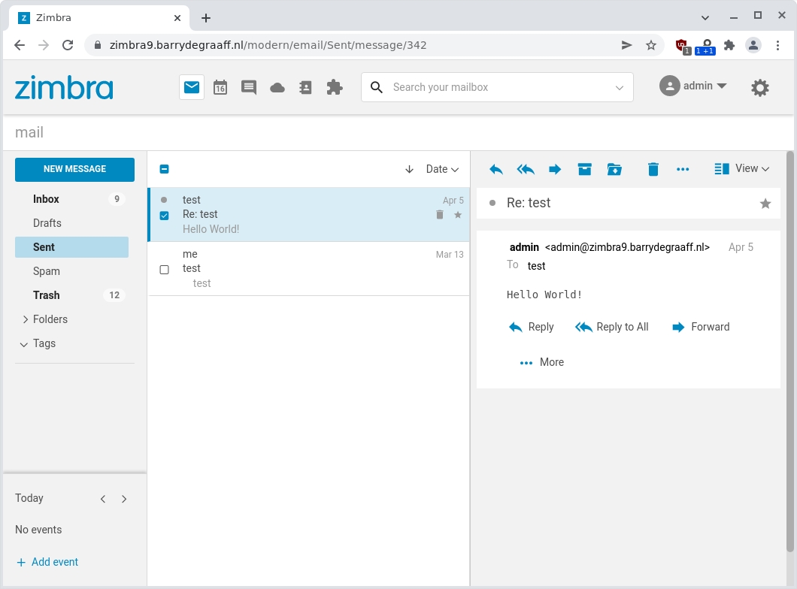
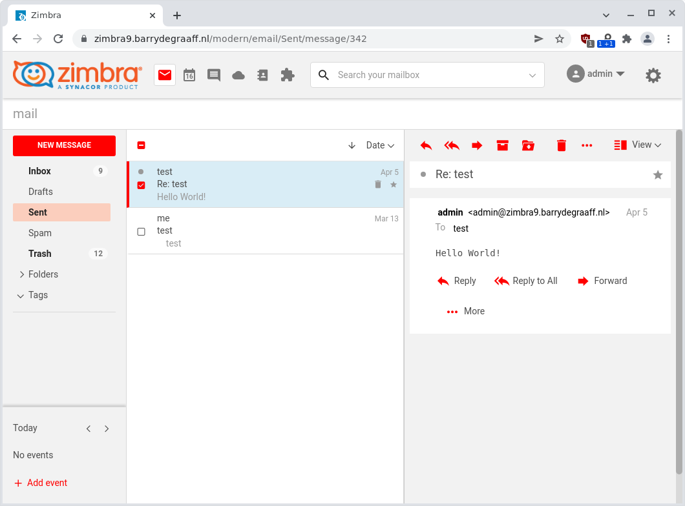

# Customizing the Modern UI theme colors and logo

With the Simple Theme customizer Zimlet you can change the Modern UI appearance in a fast and easy way. Simple Theme customizer Zimlet supports setting the primary and secondary color and the logo on Zimbra Modern UI. You can set these settings globally or per domain.

## Configuring and installing

Create a file `/tmp/zimbra-zimlet-simple-theme.xml` with the following content:

````
<zimletConfig name="zimbra-zimlet-simple-theme" version="0.0.1">
    <global>
        <property name="primaryColor">#ff0000</property>
        <property name="secondaryColor">#fbcebd</property>
        <property name="logo">url(data:image/png;base64,iVBORw0 ... 5ErkJggg==)</property>
    </global>
</zimletConfig>
````

To set a property for a specific domain you can prepend the domain with a hyphen (-) like this:

````
        <property name="example.com-primaryColor">#ffff00</property>
````

You can use a HTML color picker to find the color codes: https://htmlcolorcodes.com/color-picker/

The Zimlet uses CSS so you can set the logo via a URL or probably better by using a so-called data-uri:

````
      url('https://www.zimbra.com/wp-content/uploads/2016/06/zimbra-logo-color-282.png')    
      url(data:image/png;base64,iVBORw0 ... 5ErkJggg==)
````

The benefits of using a data-uri is that the image data is stored on Zimbra. So you do not rely on some URL that may become unavailable in the future. You can create a data-uri by using https://www.cssportal.com/image-to-data/ or https://ezgif.com/image-to-datauri. You can see a full example of config_template.xml at https://raw.githubusercontent.com/Zimbra/zimbra-zimlet-simple-theme/main/config_template.xml.

Finally install and configure the Zimlet:

````
      cd /tmp
      wget https://github.com/Zimbra/zimbra-zimlet-simple-theme/releases/download/0.0.1/zimbra-zimlet-simple-theme.zip -O /tmp/zimbra-zimlet-simple-theme.zip
      zmzimletctl deploy zimbra-zimlet-simple-theme.zip
      zmzimletctl configure /tmp/zimbra-zimlet-simple-theme.xml
      zmprov fc all
````

## Screenshots


*The default Modern UI colors.*


*Modern UI after installation of Simple Theme customizer Zimlet.*
